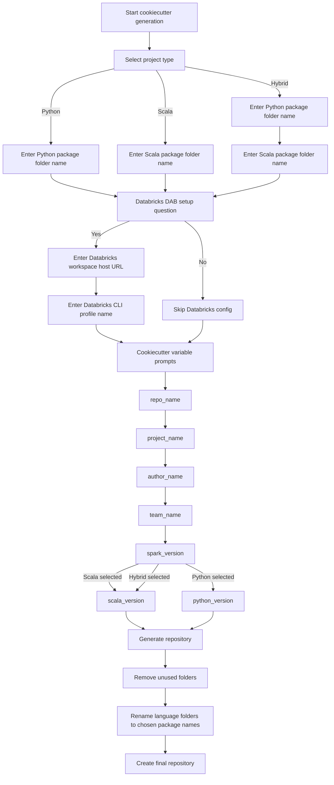

# DNA Consolidated Template Guide

The DNA consolidated Cookiecutter template is intended to provide a consistent starting point for Databricks-oriented repositories. Its purpose is to reduce repetitive setup work, establish a standard repository structure, and give teams a common foundation for Python, Scala, or Hybrid projects.

The goal of this guide is to help any user understand:

- how to create a repository from the template
- how to work with the generated project locally
- how Databricks Asset Bundle support works
- what choices can be made during the template questionnaire

## Table of Contents

1. [Overview](#overview)
2. [Questionnaire Decision Tree](#questionnaire-decision-tree)
3. [Typical Generated Structure](#typical-generated-structure)
4. [How to Generate a Repository](#how-to-generate-a-repository)
5. [After Local Repository Creation](#after-local-repository-creation)
6. [Detailed Example](#detailed-example)
7. [Cookiecutter Documentation](#cookiecutter-documentation)

## Overview

The DNA consolidated template is designed to scaffold repositories for Databricks-oriented development with a consistent structure, consistent automation, and standard build commands.

The template walks the user through a short questionnaire, generates the repository structure, and prepares the project for local development with a standard set of root-level commands.

## Questionnaire Decision Tree

The following flow chart shows the questionnaire path and the choices available during generation.



## Typical Generated Structure

The exact structure depends on the selected type, but the repository generally looks like this:

```text
repo-root/
  Makefile
  README.md
  databricks.yml                # only when Databricks support is enabled
  .github/
    actions/
      build-and-deploy/
        action.yml
    workflows/
      python-pr-check.yml       # Python or Hybrid
      scala-pr-check.yml        # Scala or Hybrid
  <python-package-folder>/      # Python or Hybrid
    pyproject.toml
    resources/
    src/
  <scala-package-folder>/       # Scala or Hybrid
    build.sbt
    project/
      build.properties
      plugins.sbt
    resources/
    src/
```

## How to Generate a Repository

Before generating a repository, make sure you have the following tools available as needed:

- Git
- Cookiecutter
- Python 3.11 or later for Python-based projects
- Java 21 and sbt for Scala-based projects
- Databricks CLI if you plan to enable Databricks support

Run Cookiecutter from the template root.

```bash
cookiecutter dna-consolidated-template
```

During generation, the template prompts for:

- repository name
- project name
- author name
- team name
- Spark version
- project type: Python, Scala, or Hybrid
- package folder name(s)
- whether Databricks Asset Bundle support should be enabled
- Databricks host and Databricks CLI profile if Databricks support is enabled

## After Local Repository Creation

Use the generated repository as a starting point, not as a finished implementation.

- Create a new repository in GitHub with the same name as the generated project.
- Adjust the generated code to meet your needs. The template creates boilerplate, and every real project will need customization.
- Make your changes in a feature branch, create a pull request, and merge it into `main` after approval.

## Detailed Example

Below is a full example of a user generating a Hybrid repository with Databricks support.

### Generation

```text
$ cookiecutter dna-consolidated-template

Select project type:
1 - python
2 - scala
3 - hybrid
Choose [1/2/3]: 3

Enter Python package folder name: py_pkg
Enter Scala package folder name: sc_pkg

Databricks Asset Bundle (DAB) setup:
Do you want to set up Databricks DAB? [y/n]: y
Enter Databricks workspace host URL: https://adb-1234567890123456.7.azuredatabricks.net/
Enter Databricks CLI profile name: dev-public

[1/6] repo_name (dna-sample-service): dna-hybrid-service
[2/6] project_name (DNA Sample Service): DNA Hybrid Service
[3/6] author_name (Your Name): Example User
[4/6] team_name (DPS): DPS
[5/6] spark_version (3.5.0): 3.5.0
[6/6] scala_version (2.12.18): 2.12.18
```

## Cookiecutter Documentation

For full Cookiecutter usage, prompts, replay files, template authoring, and advanced options, refer to the official documentation:

https://cookiecutter.readthedocs.io/en/stable/
